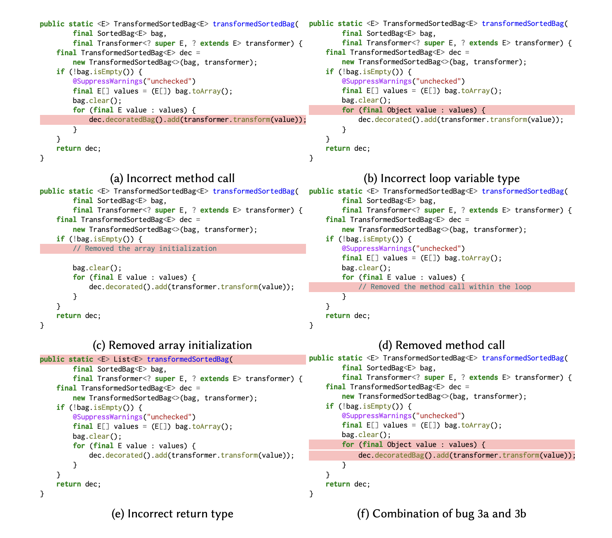

# Challenging Bug Prediction and Repair Models with Synthetic Bugs
Anonymous artifact repository of BUGFARM.

## Abstract
Bugs are essential in software engineering; many research studies in the past decades have been proposed to detect, localize, and repair bugs in software systems. Effectiveness evaluation of such techniques requires complex bugs, i.e., those that are hard to detect through testing and hard to repair through debugging. From the classic software engineering point of view, a hard-to-repair bug differs from the correct code in multiple locations, making it hard to localize and repair. Hard-to-detect bugs, on the other hand, manifest themselves under specific test inputs and reachability conditions. These two objectives, i.e., generating hard-to-detect and hard-to-repair bugs, are mostly aligned; a bug generation technique can change multiple statements to be covered only under a specific set of inputs. However, these two objectives conflict in the learning-based techniques: A bug should have a similar code representation to the correct code in the training data to challenge a bug prediction model to distinguish them. The hard-to-repair bug definition remains the same but with a caveat: the more a bug differs from the original code (at multiple locations), the more distant their representations are and easier to detect. This demands new techniques to generate bugs to complement existing bug datasets to challenge learning-based bug prediction and repair techniques. We propose BUGFARM to transform arbitrary code into multiple hard-to-detect and hard-to-repair bugs. BUGFARM mutates code in multiple locations (hard-to-repair) but leverages attention analysis to change only the least attended locations by the underlying model (hard-to-detect). Our comprehensive evaluation of 435k+ bugs from over 1.9M mutants generated by BUGFARM and two alternative approaches demonstrates our superiority in generating bugs that are hard to detect by learning- based bug prediction approaches (up to 40.53% higher False Negative Rate and 10.76%, 5.2%, 28.93%, and 20.53% lower Accuracy, Precision, Recall, and F1 score) and hard-to-repair by state-of-the-art learning-based program repair technique (28% repair success rate compared to 36% and 49% of LEAM and μBERT bugs). BUGFARM is efficient, i.e., it takes nine seconds to mutate a code with no training overhead.

## Datasets
Please download the required datasets to reproduce our experiments from [Zenodo](https://doi.org/10.5281/zenodo.8388299).

## Dependencies
All experiments require Python 3.9 and a Linux/Mac OS. Please execute the following to install dependencies and download the projects:

`sudo bash setup.sh`

Moreover, you need to setup the [tokenizer tool](https://github.com/devreplay/source-code-tokenizer).

Please refer to each module under `/src` for detailed explanation of how to perform the experiments.

## Sample Prompt

### project
commons-cli

### file_path
projects/commons-cli/src/main/java/org/apache/commons/cli/DefaultParser.java

### start_line
392

### end_line
407

### method
```
private void handleOption(Option option) throws ParseException {
    // check the previous option before handling the next one
    checkRequiredArgs();
    option = (Option) option.clone();
    updateRequiredOptions(option);
    cmd.addOption(option);

    if (option.hasArg()) {
        currentOption = option;                                  
    } else {
        currentOption = null;                                    
    }
}
```

### attention weights


### chatgpt prompt
```
Observe the following java method where each statement has a specific ID starting from 0. Can you produce 3 different buggy versions of this method by changing statements "7-  currentOption = option;" and "9-  currentOption = null;" only? Do not change other statements in the given java code.

You have to write each buggy method again. Do not write anything else in your response. Make sure your generated buggy java code is compilable and does not have syntax errors and compile-time errors. Do not use a variable which does not exist in the scope of the given method. You should put <start1> <start2> <start3> and <end1> <end2> <end3> in the beginning and end of each buggy method so I could parse your response later.

0-  private void handleOption(Option option) throws ParseException {
1-  // check the previous option before handling the next one
2-  checkRequiredArgs();
3-  option = (Option) option.clone();
4-  updateRequiredOptions(option);
5-  cmd.addOption(option);
6-  if (option.hasArg()) {
7-  currentOption = option;                                          
8-  } else {
9-  currentOption = null;                                            
10- }
11- }
```

### chatgpt response

```
<start1>
private void handleOption(Option option) throws ParseException {
    checkRequiredArgs();
    option = (Option) option.clone();
    updateRequiredOptions(option);
    cmd.addOption(option);
    if (option.hasArg()) {
        currentOption = null;       // buggy                                
    } else {
        currentOption = option;     // buggy                     
    }
}
<end1>

<start2>
private void handleOption(Option option) throws ParseException {
    checkRequiredArgs();
    option = (Option) option.clone();
    updateRequiredOptions(option);
    cmd.addOption(option);
    if (option.hasArg()) {
        currentOption = null;        // buggy                              
    } else {
        currentOption = null;                                    
    }
}
<end2>

<start3>
private void handleOption(Option option) throws ParseException {
    checkRequiredArgs();
    option = (Option) option.clone();
    updateRequiredOptions(option);
    cmd.addOption(option);
    if (option.hasArg()) {
        currentOption = option;
    } else {
        currentOption = option;       // buggy                         
    }
}
<end3>
```

### selected bugs
bug 1,2,3

## Ablation Study (Necessity of Prompt Engineering)

The quality of prompts significantly impacts the quality of the model’s response; the more context you provide to the model in the prompt, the better the response it produces. The following figures show different kinds of bugs generated without prompt engineering:


